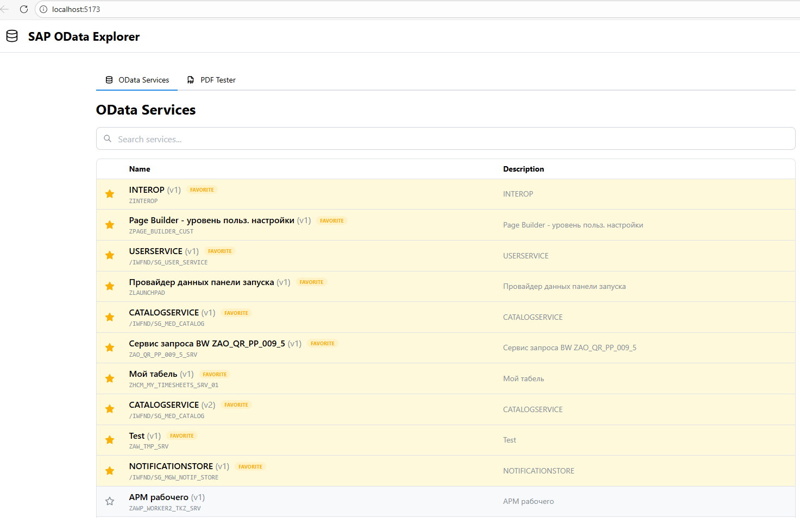
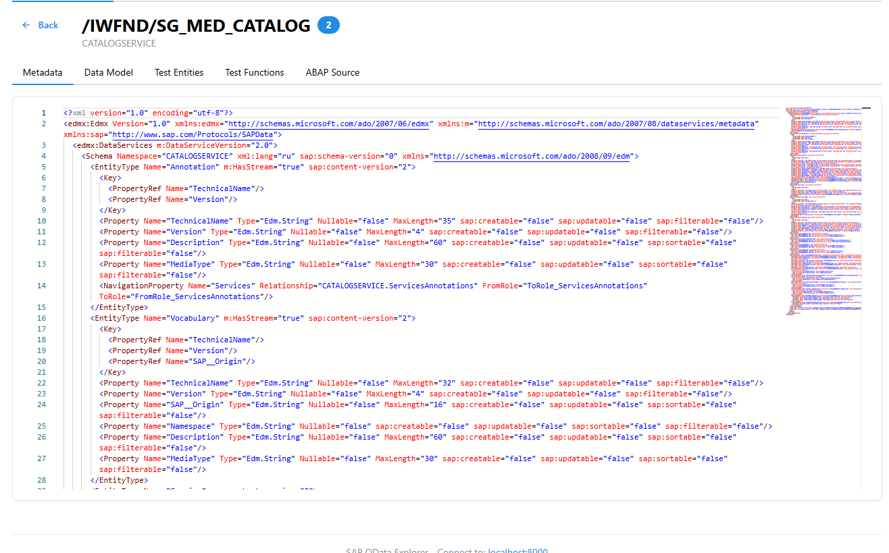
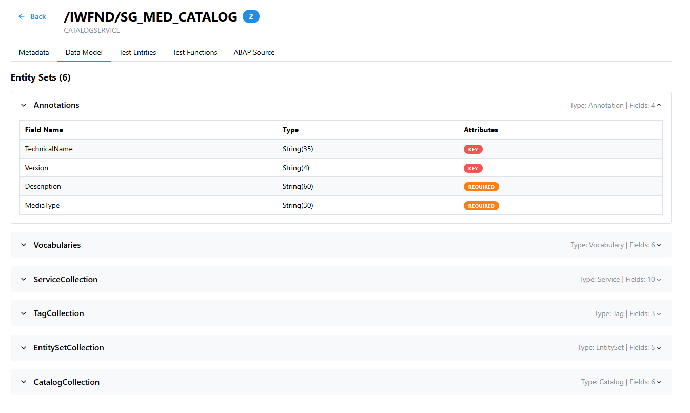

# SAP OData Explorer

Приложение для просмотра, тестирования и исследования OData сервисов в SAP ECC системе.

## 📸 Скриншоты интерфейса

### Список сервисов


### Метаданные сервиса


### Модель данных


## 🚀 Возможности

- 📋 Просмотр списка всех опубликованных OData сервисов
- 🔍 Поиск и фильтрация сервисов
- 📄 Просмотр метаданных ($metadata) с подсветкой синтаксиса
- 🧪 Тестирование OData запросов (GET, POST, PUT, PATCH, DELETE)
- 🔧 Удобный Query Builder

## 📁 Структура проекта

```
sap-odata-explorer/
├── backend/                 # Node.js + Express + TypeScript
│   ├── src/
│   │   ├── config/         # Конфигурация SAP
│   │   ├── routes/         # API endpoints
│   │   ├── services/       # SAP HTTP клиент
│   │   └── app.ts          # Точка входа
│   └── .env               # Переменные окружения
│
└── frontend/               # React + TypeScript + Vite
    ├── src/
    │   ├── components/     # React компоненты
    │   ├── services/       # API клиент
    │   └── hooks/          # React Query hooks
    └── package.json
```

## 🛠️ Технологии

### Backend
- Node.js 18+
- Express
- TypeScript
- Axios (HTTP client)
- CORS

### Frontend
- React 18
- TypeScript
- Vite (build tool)
- Material-UI (MUI)
- TanStack Query (React Query)
- Monaco Editor (XML/JSON просмотр)

## 🚀 Быстрый старт

### 1. Настройка окружения

Создайте файл `backend/.env`:

```env
# SAP System Configuration
SAP_HOST=your-sap-host.com
SAP_PORT=8000
SAP_USER=your-username
SAP_PASSWORD=your-password

# Server Configuration
PORT=3001
```

### 2. Запуск Backend

```bash
cd backend
npm install
npm run dev
```

Backend будет доступен на `http://localhost:3001`

### 3. Запуск Frontend

```bash
cd frontend
npm install
npm run dev
```

Frontend будет доступен на `http://localhost:5173`

## 📡 API Endpoints

| Endpoint | Method | Описание |
|----------|--------|----------|
| `/api/health` | GET | Проверка состояния |
| `/api/services` | GET | Список OData сервисов |
| `/api/services/:name/metadata` | GET | Метаданные сервиса |
| `/api/services/:name/entities` | GET | Список Entity Sets |
| `/api/test` | POST | Тестовый запрос |

## 🐳 Docker

Запуск через Docker Compose:

```bash
# Создайте .env файл в корне проекта
cp backend/.env.example .env
# Отредактируйте .env

# Запуск
docker-compose up -d
```

## 📝 Примеры использования

### Поиск сервисов

```
GET /api/services?search=Flight
```

### Получение метаданных

```
GET /api/services/ZGW_SAMPLE_SRV/metadata
```

### Тестовый запрос

```bash
curl -X POST http://localhost:3001/api/test \
  -H "Content-Type: application/json" \
  -d '{
    "method": "GET",
    "url": "/ZGW_SAMPLE_SRV/FlightCollection"
  }'
```

### Пример ответа метаданных (частичный)
```xml
<edmx:Edmx Version="4.0">
  <edmx:DataServices>
    <Schema Namespace="ZGW_SAMPLE_SRV">
      <EntityType Name="Flight">
        <Key>
          <PropertyRef Name="FlightDate"/>
          <PropertyRef Name="FlightConnectionID"/>
        </Key>
        <Property Name="FlightDate" Type="Edm.DateTime" Nullable="false"/>
        <Property Name="FlightConnectionID" Type="Edm.String" MaxLength="6" Nullable="false"/>
        <Property Name="Price" Type="Edm.Decimal" Precision="12" Scale="3"/>
        <NavigationProperty Name="ToCustomer" Type="Collection(ZGW_SAMPLE_SRV.Customer)"/>
      </EntityType>
    </Schema>
  </edmx:DataServices>
</edmx:Edmx>
```

## 🔒 Безопасность

- Логин и пароль SAP хранятся только в `.env` файле backend
- Basic Auth передается через заголовки HTTP
- Не коммитьте `.env` файлы в репозиторий

## 📄 Лицензия

MIT
